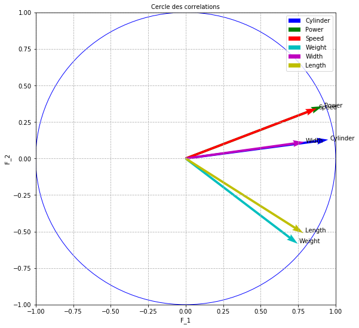
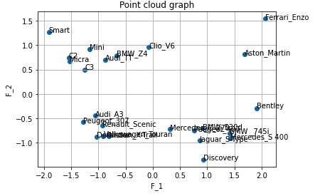
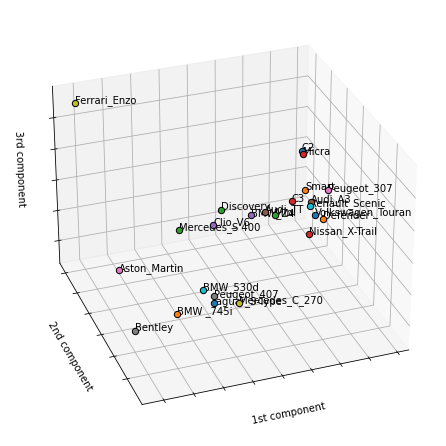

# PCA in Generalized Convex Spaces

### phi_alpha-PCA is a robust PCA in the generalized convex spaces

In this package, we find:

  * The projection matrix (F)
  * Eigenvualues, percentage of variance and cumulative percentage of variance
  * Relative contributions of variables
  * Relative contributions of the observations
  * Absolute contributions of the observations (cos²)
  * Search for optimal alpha in order to detect and minimize the influence of outliers
  * 2D graphics of the observations
  * 3D graphics of the observations
  * correlation circle 
  * Example on cars data below


### What do you need for this package ?
* You need your data in an excel file with the extension (.xlsx)
* You also need to put on the fist row the name of the variables and on the first column the name of the observations

### Import phi_alpha-PCA


```python
from ACP_phi_alpha import Pca_alpha
```

### Import plot utilities: example on cars data


```python
import pandas as pd
import numpy as np
import scipy.stats as ss
import matplotlib.pyplot as plt
from mpl_toolkits.mplot3d import Axes3D
from sklearn.preprocessing import StandardScaler
from numpy.linalg import inv
from scipy import linalg
from sklearn import preprocessing
import matplotlib.animation as animation
import math
```

### Import data 


```python
x = pd.read_excel("cars.xlsx", header=0, index_col=0) #import your excel file with your data
```

### Search for optimal alpha in order to detect and minimize the influence of outliers


```python
alpha = 1 #standard PCA
model = Pca_alpha(alpha)
print("optimal_alpha")
print(model.hotelling(x, 0.1))
```

    optimal_alpha
    2.2


### Run the model by setting your own optimal alpha parameter in ]0,10] and != 0 


```python
alpha = 2.2 #optimal alpha
model = Pca_alpha(alpha)
```

### Correlation circle 


```python
print("circle of correlation")
print(model.circle_correlation(x))
```

    circle of correlation


    

    


    None


### Find the projection matrix (F)


```python
print("projection")
print(model.project(x, alpha))
```

    projection
    [[-1.54281509  0.73632116 -0.45765918  0.44172456 -0.20802278  0.48887612]
     [-1.90958097  1.2611019   0.55548359 -0.9647609   0.21387889  0.20087085]
     [-1.15838788  0.91157138  0.63823858 -0.25865668 -0.25852552 -0.70539745]
     [-1.52031068  0.66203487 -0.4513449   0.38769161 -0.2580553   0.56913536]
     [-0.07269504  0.96068283  0.64809947 -0.55533719  0.4012112  -0.56592832]
     [-1.0531733  -0.44552577 -0.44477922  0.54796075  0.28104968  0.30379105]
     [-1.28139693 -0.57888914 -0.67013943  0.62604844 -0.33987635  0.5241112 ]
     [ 0.76365796 -0.7448234   0.53868186  0.61069623 -0.13001343 -0.06839642]
     [ 0.31448964 -0.71747417  0.74694198  0.63488964  0.37193876 -0.38240561]
     [ 0.92275756 -0.70265692  0.44008268  0.83656688  0.18890111 -0.24564512]
     [ 0.8620841  -0.95217767  0.49134347  0.75289519 -0.39572109 -0.35070811]
     [ 1.40906711 -0.79871907  0.6611047   0.43892367 -0.32679527  0.62501701]
     [ 1.42109684 -0.90848082 -0.71395621  0.40711774  0.53851683 -0.26992101]
     [-1.2461101   0.49991246  0.16392063  0.46373184 -0.20962515  0.09206234]
     [-0.65867894  0.7903796   0.47993239  0.60928339  0.40291221 -0.39524006]
     [-0.87815164  0.70207813  0.40204341  0.60723849 -0.30748247 -0.66674263]
     [ 1.68594026  0.81608948  1.0024644  -0.48025327  0.5122901   0.65205866]
     [ 1.91180017 -0.28759436  1.20035061 -0.9210133  -0.51161572 -0.41022063]
     [ 2.06816971  1.53854567 -1.30923216  0.37633773 -0.34584719  0.30575829]
     [-0.92470407 -0.64441694 -0.52821552  0.37005921 -0.12060845 -0.31911867]
     [-0.90609751 -0.85742003 -0.5190306   0.40032909 -0.16314245  0.04867123]
     [-1.0319685  -0.87818431 -0.45415099 -1.07915584  0.11473029  0.58443648]
     [ 0.92911072 -1.34526124 -1.20896728 -0.99986829  0.21683842 -0.58801665]
     [-0.80137837 -0.8625197  -0.24556609  0.37655475 -0.37952865  0.45182214]]


### Find the Eigenvualues, the percentage of inertia and the cumulative percentage of inertia


```python
print("Eigenvalues")
print(model.eigenvalues(x))
```

    Eigenvalues
    [[  1.96  43.7   43.7 ]
     [  0.93  20.71  64.4 ]
     [  0.69  15.26  79.66]
     [  0.52  11.54  91.2 ]
     [  0.14   3.02  94.22]
     [  0.26   5.78 100.  ]]


### Absolute contributions of the observations


```python
print("absolute contributions of the observations")
print(model.absolute_contributions_observations(x))
```

    absolute contributions of the observations
    [['C2' 6.521818514915534 3.0544403909373394 1.8566328404955899
      2.048793293897643 1.722497884534968 4.899824003617121]
     ['Smart' 9.991187468901702 8.959782207812047 2.7351687489782917
      9.773146894795547 1.8208440361221676 0.8272116950295209]
     ['Mini' 3.676621821121606 4.681429215948653 3.6108360939722557
      0.7024937097431125 2.660380303174016 10.201184398695625]
     ['Micra' 6.332943963272783 2.4692145697366907 1.8057546157664126
      1.5782210911323682 2.650711468395669 6.640701774347112]
     ['Clio_V6' 0.014479398562612694 5.19944700245885 3.7232739853470482
      3.2382364132657173 6.407416855471292 6.566072797887173]
     ['Audi_A3' 3.0390694875860444 1.1182598882194477 1.7536004464215673
      3.152781967248145 3.144148627636894 1.8920507172550596]
     ['Peugeot_307' 4.498920419707928 1.8879387581530829 3.9808150612337583
      4.115389207738079 4.598103786503217 5.631572887159664]
     ['Peugeot_407' 1.5978599873057047 3.1253864394823125 2.5722096719177396
      3.916025590908731 0.67284238367758 0.0959068384811646]
     ['Mercedes_C_270' 0.2709902415052318 2.9000776843424125
      4.945559174314532 4.232446897975527 5.506552224398845 2.997997968764032]
     ['BMW_530d' 2.33300773220006 2.7815299835082414 1.7167624684528882
      7.348460760506065 1.4203845094914354 1.2370837532233936]
     ['Jaguar_S-Type' 2.036292768410664 5.107790570030116 2.1399914925076007
      5.952015899909532 6.233260715939697 2.5215898993302654]
     ['BMW _745i' 5.440067756320727 3.594058982742592 3.874201064593938
      2.022893575706082 4.250973566680839 8.008782570624717]
     ['Mercedes_S 400' 5.533352036412444 4.649739439847457 4.51840142984332
      1.7403440151121483 11.54344517688179 1.4936753479187819]
     ['C3' 4.254551457464709 1.407942831465563 0.23818196074703607
      2.258025617024961 1.7491363121521233 0.17375882777650603]
     ['BMW_Z4' 1.1887444654478454 3.5193992985416145 2.0417463638508675
      3.897927156478901 6.461863164909134 3.2026150528344983]
     ['Audi_TT' 2.112905066475644 2.776949506353988 1.4328065204519747
      3.8718063542455536 3.7633760567567087 9.11379559906228]
     ['Aston_Martin' 7.787988705789664 3.752084856488507 8.907987155963905
      2.421785684445743 10.44645209569463 8.716781738790456]
     ['Bentley' 10.01442323064706 0.46596986003922014 12.771970244798494
      8.906905502141623 10.418966784048477 3.44998997219207]
     ['Ferrari_Enzo' 11.719613789187889 13.335763325113751 15.194100358541803
      1.4871356128062543 4.761078934058655 1.9166345958987512]
     ['Renault_Scenic' 2.342860836639947 2.3395427982254517 2.473227040853393
      1.43792907329152 0.5790184398479062 2.0877920845213067]
     ['Volkswagen_Touran' 2.249525022030785 4.141754417020492
      2.387963018336734 1.6827877769653734 1.0594265564768888
      0.04856545229211642]
     ['Defender' 2.9179230600164385 4.344786476989818 1.8282778114469127
      12.228223712768159 0.5239539152622414 7.002570099853714]
     ['Discovery' 2.36524372028295 10.195542844986893 12.955994594108041
      10.497372998881714 1.8715841462045906 7.08862615944415]
     ['Nissan_X-Trail' 1.7596090497940229 4.191168651555489
      0.5345378370558951 1.4888511930115018 5.733582055680229
      4.185215765000516]]


### Absolute contributions of the variables


```python
print("absolute contributions of the variables")
print(model.absolute_contributions_variables(x)[0])
```

    absolute contributions of the variables
    [['Cylinder' 18.58110680413267 6.985148012078414 12.21583766951254
      11.349670478279652 29.59090091235105 25.641300371095678]
     ['Power' 17.893710301741063 17.68475622084613 8.12439998866286
      8.68149142952098 5.1060687697342715 38.58599563801424]
     ['Speed' 17.236962668447052 17.049287018082406 17.211528200178737
      19.03982690491878 26.112450019369238 16.919650778077994]
     ['Weight' 14.936267693172796 27.611982713326256 12.680181580131741
      24.02275122617001 18.50088837225277 0.5687764568393752]
     ['Width' 15.72927731449335 6.184091771414021 44.23595921307722
      7.1664683436106325 7.917399275197931 7.696123637423151]
     ['Length' 15.622675218013068 24.48473426425278 5.5320933484369155
      29.739791617499943 12.772292651094736 10.58815311854956]]


### Relative contributions of the observations (cos²) 


```python
print("relative contributions of the observations")
print(model.relative_contributions_observations(x))
```

    relative contributions of the observations
    [[65.9 15.   5.8  5.4  1.2  6.6]
     [55.6 24.2  4.7 14.2  0.7  0.6]
     [41.8 25.9 12.7  2.1  2.1 15.5]
     [66.1 12.5  5.8  4.3  1.9  9.3]
     [ 0.2 43.2 19.6 14.4  7.5 15. ]
     [56.1 10.  10.  15.2  4.   4.7]
     [51.2 10.4 14.  12.2  3.6  8.6]
     [32.  30.4 15.9 20.5  0.9  0.3]
     [ 5.3 27.7 30.  21.7  7.4  7.9]
     [36.5 21.1  8.3 30.   1.5  2.6]
     [27.1 33.1  8.8 20.7  5.7  4.5]
     [52.9 17.  11.7  5.1  2.8 10.4]
     [52.  21.3 13.1  4.3  7.5  1.9]
     [74.  11.9  1.3 10.3  2.1  0.4]
     [21.9 31.6 11.6 18.8  8.2  7.9]
     [33.  21.1  6.9 15.8  4.1 19.1]
     [52.3 12.3 18.5  4.2  4.8  7.8]
     [56.6  1.3 22.3 13.1  4.1  2.6]
     [49.1 27.2 19.7  1.6  1.4  1.1]
     [47.4 23.  15.5  7.6  0.8  5.6]
     [40.7 36.5 13.4  8.   1.3  0.1]
     [29.9 21.7  5.8 32.7  0.4  9.6]
     [15.6 32.7 26.4 18.1  0.9  6.3]
     [33.2 38.4  3.1  7.3  7.4 10.5]]


### 2D graphics of the observations


```python
print("plot 2D")
print(model.plot2D(x, alpha))
```

    plot 2D


    

    


    None


[Stack Abuse](http://stackabuse.com)

### 3D graphics of the observations


```python
print("plot 3D")
print(model.plot3D(x, alpha))
```

    plot 3D
    None


    

    


